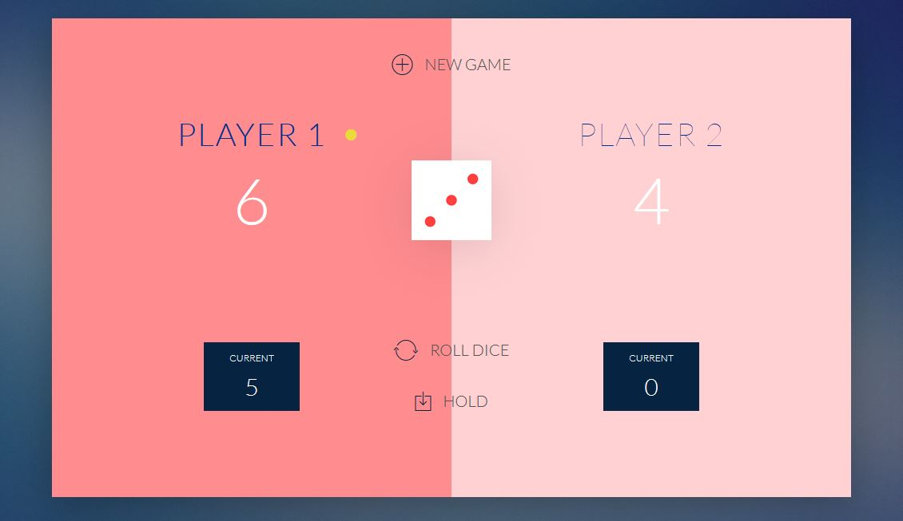

# Roll A Dice

## Contents

1. Project Description
2. System Look
3. The Repository
4. Future Development
5. Help

## 1. Project Description  
This is a simple game created using JavaScript, with an utilisation of HTML and CSS.

GAME RULES:
- The game has 2 players, playing in rounds.
- In each turn, a player rolls a dice as many times as they wish. Each result gets added to his ROUND (Current) score.
- If the player rolls a 1, all his ROUND score gets lost. After that, it is the next player's turn.
- A player looses his entire score when he rolls two 6 i n a row.After that, the next player continues.
- The player can choose to 'Hold', which means that his ROUND score gets added to his GLOBAL score. After that, it is the next player's turn.
- The first player to reach 100 points on GLOBAL score wins the game.

## 2. System look
The below are screenshots of the game:

## 2.1 Initial State

## 2.2 Game Running

## 3. The Repository  
The repository consists of:
- index file to run the game 
- JavaScript file containing the game's logic
- CSS file setting the game's visual look
- dice pictures
- screenshots of the game

## 4. Future Development 
Future development of this application may include:
- user profiles
- adding more players
- adding colour themes

## 5. Help  
Please do not hesitate to contact me on the below e-mail if you encounter any problems or need further information.
Contact: <b>lukaszbol[at]yahoo[dot]co[dot]uk</b>
