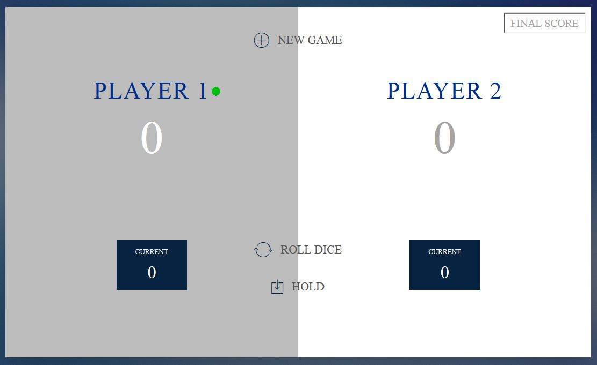
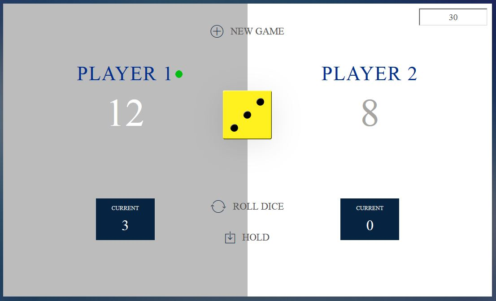
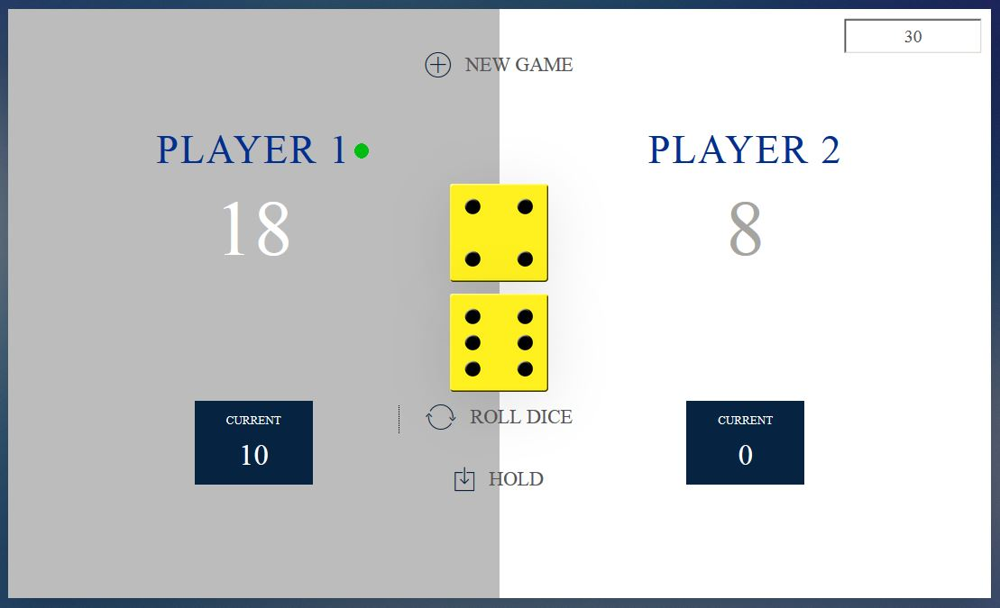
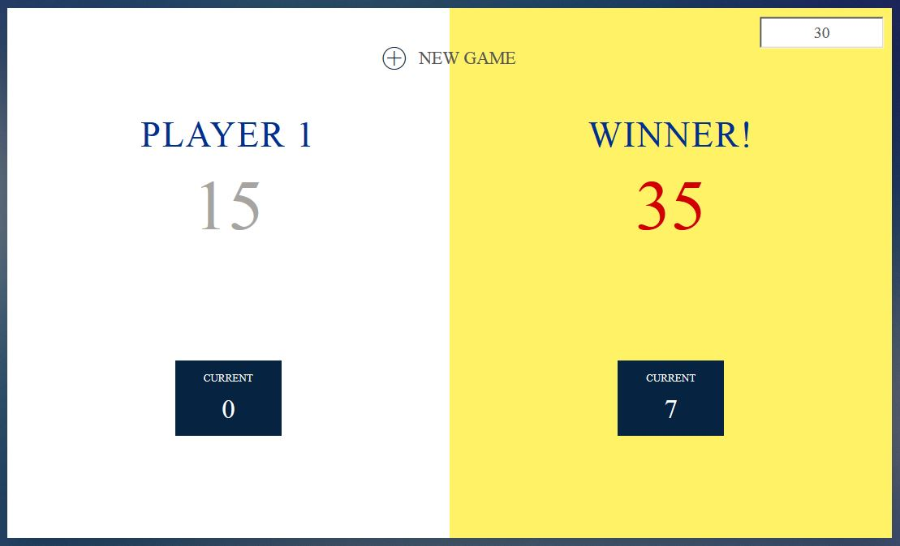

# Roll A Dice

## Contents

1. Project Description
2. System Look
3. The Repository
4. What Went Wrong
5. What I Have Learned
6. Future Development
7. Help

## 1. Project Description  
<b>Date of the project: 03/2018   </b>

This is a simple game created using JavaScript, with an utilisation of HTML and CSS.

GAME RULES:
- The game has 2 players, playing in rounds.
- At the start of the game, the player sets how many dices they want to use (1 or 2).
- Then, the player sets FINAL SCORE (e.g. 20 points), in the upper-right corner.
- In each turn, a player rolls a dice as many times as they wish. Each result gets added to their ROUND (Current) score.
- The player can choose to 'Hold', which means that their ROUND score gets added to the player's GLOBAL score. After that, it is the next player's turn.
- The first player to reach the winning score (e.g. 20 points) on GLOBAL score wins the game.

1 DICE game specific game rules:
- If the player rolls a 1, all their ROUND score gets lost. After that, it is the next player's turn.
- A player looses his entire score when he rolls two 6 in a row. After that, the next player continues.

2 DICES game specific game rules:
- If the player rolls a 1 on one of the dices, all their ROUND score gets lost. After that, it is the next player's turn.

## 2. System Look
The below are screenshots of the game:

## 2.1 Initial State

## 2.2 Game Running With 1 Dice

## 2.3 Game Running With 2 Dices

## 2.4 Winning Player

## 3. The Repository  
The repository consists of:
- index - index file to run the game 
- application - JavaScript file containing the game's logic
- style - CSS file setting the game's visual look
- images - pictures used in the game
- gamePictures - screenshots of the game

## 4. What Went Wrong
- the UI and colour patterns could be improved
- CSS not fully understood

## 5. What I Have Learned
- declaring variables, writing functions and general syntax in JavaScript
- JavaScript DOM operations
- data type coercion in JavaScript
- some CSS styling
- increased HTML knowledge

## 6. Future Development 
Future development of this application may include:
- user profiles
- adding more players
- adding colour themes

## 7. Help  
Please do not hesitate to contact me on the below e-mail if you encounter any problems or need further information.
Contact: <b>lukaszbol[at]yahoo[dot]co[dot]uk</b>
